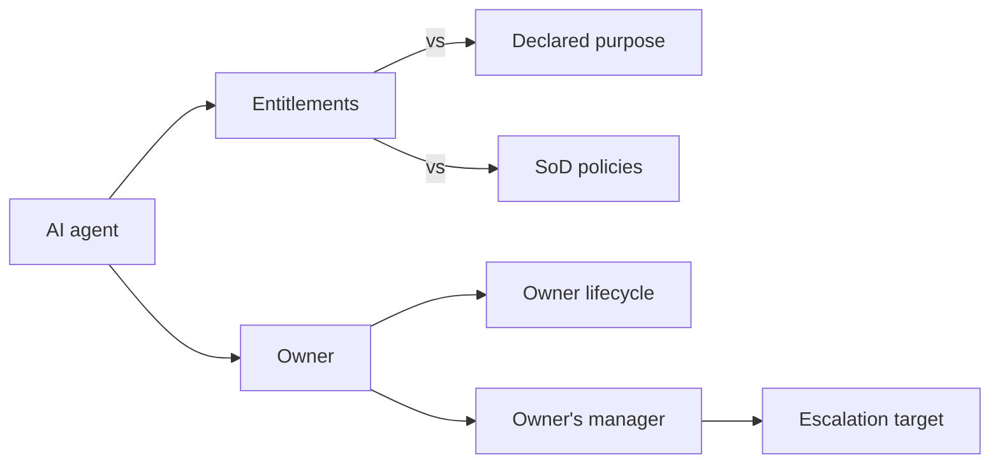
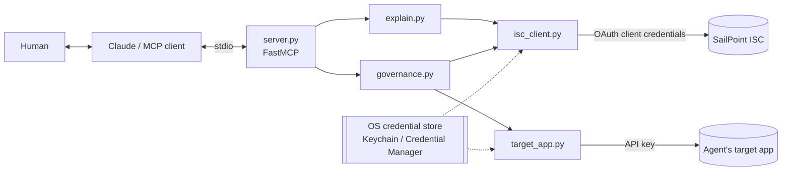

# Green Isn't Safe

**Catching a rogue AI agent through its accountability chain, then containing it with a human in the loop.**

An MCP server for SailPoint Identity Security Cloud (ISC) that lets an AI assistant **explain** access,
**expose** the governance gaps that point-in-time checks miss, **detect** rogue AI agents, and
**contain** them, but only after a human approves.

> *Your dashboards say green. Ask the agent what they're not telling you.*

**SailPoint Navigate 2026 Hack Day** · Track: MCP Server · Team: Sai Ravula, Alex, Muyiwa, Priya
Full business case: **[docs/business-case.md](docs/business-case.md)** · Slides: **[PDF](docs/Green-Isnt-Safe-Navigate26.pdf)** / [PPTX](docs/Green-Isnt-Safe-Navigate26.pptx)

---

## The problem

AI agents are getting access faster than governance is adapting. Each agent gets an owner, a purpose and
some entitlements, and then the chain behind it decays quietly:

- its **owner leaves the company**, but the agent keeps running
- it **gains access beyond its declared purpose**, one direct grant at a time
- its access combination **violates separation of duties**

Every point check still passes: the agent is registered, it has an owner, and its account is active.
**Nobody is accountable for it, and it can move money.**

**Root cause:** accountability is a property of a *chain*, but ISC is viewed one object at a time:



No single screen shows the chain, so no one checks it. Humans already have this gap, and agents inherit it.

## What we found in the demo tenant (measured live)

| Finding | Measured |
|---|---|
| The ownership check passes, but the bus factor is 1 | Ownerless objects = **0**, yet **45 of 47** roles, access profiles and sources (**96%**) are owned by **one identity with no manager** |
| Leavers keep live accounts | **9 of 9** inactive identities still have **27 enabled accounts**, including AD accounts with *password never expires* |
| Privileged access sits outside the role model | **33 of 51** privileged grants (**65%**) are direct grants that no role or access profile justifies |
| Rogue agent | `invoice-bot`: owner is an inactive leaver, holds access beyond its declared purpose, and violates an ENFORCED SoD policy. **Risk 90 / CRITICAL** |

---

## What it does

| Capability | Ask the assistant | MCP tool | Mode |
|---|---|---|---|
| Find people | "Who is Adam Kennedy?" | `search_identities` | Read-only |
| **Explain** | "Why does invoice-bot have AccountsReceivable?" | `explain_access` | Read-only |
| **Expose** | "Is our governance healthy?" | `find_accountability_gaps` | Read-only |
| **Detect** | "Are any of our AI agents rogue?" | `detect_rogue_agents` | Read-only |
| **Contain** | "Quarantine invoice-bot." | `quarantine_agent` | **Dry run first** (server-enforced), then human-confirmed |

Every result includes **`evidence[]`** (ISC object IDs and timestamps), so an auditor can replay each claim against ISC.

### Detection signals and scoring
`detect_rogue_agents` walks each agent's chain and scores it from 0 to 100:

| Signal | Weight | Meaning |
|---|---|---|
| `ORPHANED_OWNER` | 40 | The owner is inactive, deleted, or missing |
| `SOD_CONFLICT` | 30 | The agent's entitlements violate a tenant SoD policy (**matched by entitlement ID**) |
| `PURPOSE_DRIFT` | 20 | It holds entitlements beyond its declared purpose |
| `OWNER_NO_MANAGER` | 10 | The owner has no manager, so escalation falls back to a governance owner |
| `PRIVILEGED_DIRECT` | 10 | Privileged entitlements granted directly |

Severity: **≥70 CRITICAL (rogue)** · ≥40 HIGH · ≥20 MEDIUM · otherwise LOW.

Live results across the 5-agent fleet:

| Agent | Owner | Score |
|---|---|---|
| invoice-bot | Denise.Hunt (inactive) | **90 CRITICAL** |
| deploy-bot | Sandra.Lopez (inactive) | 60 HIGH |
| payroll-sync-bot | samantha.holstine (no manager) | 10 LOW |
| green-isnt-safe-governor *(our own agent)* | hack.day | 10 LOW |
| hr-onboarding-bot | Evelyn.Ellis (active) | **0 LOW** |

### Containment (`quarantine_agent`)
1. **Dry run, always first.** It returns a 4-step plan and a `confirmationToken`, and changes nothing.
2. With `confirm=true` **and that token**, after a human approves. The server refuses `confirm=true` without a
   token from a dry run of the same agent at the same risk score in the last 10 minutes, so the model can't skip the plan.
   - **ISC:** tags the agent's account and identity `AGENT_QUARANTINED`. For agents registered as ISC
     machine identities, it submits the native `DEACTIVATE` lifecycle action instead.
   - **Target app:** disables the agent's account in the system it acts on.
3. **Recommended, not executed:** revoking the drifted or SoD-conflicting access, and reassigning the
   owner (escalated to the departed owner's manager).

Every containment is logged at WARN with the human's stated reason. `reset_demo.py --apply` reverses it.

---

## Architecture



| File | Purpose |
|---|---|
| `server.py` | MCP tool registration and `--selftest` |
| `isc_client.py` | Shared ISC client: OAuth, retry with backoff, 429 handling, pagination, redacted logging |
| `explain.py` | `explain_access` (role → access profile → entitlement path, or direct grant) |
| `governance.py` | Agent registry adapter, chain scoring, `find_accountability_gaps`, `detect_rogue_agents`, `quarantine_agent` |
| `target_app.py` | Client for the agent's target application (SailPoint SaaS Connectivity Demo API) |
| `reset_demo.py` | Restores the demo to its starting state |
| `merge_rows.py` | Configures merge rows on the `Bots` delimited-file source |
| `store_credentials.py` | Stores keys in the OS credential store from a hidden prompt (macOS and Windows) |
| `setup.ps1` | One-shot Windows setup and self-test |
| `scenario/ai-agents.csv` | The 5-agent fleet aggregated into the `Bots` source |
| `agents.json` | Offline fallback registry (used only when ISC returns no agents) |
| `tests/` | Offline unit tests for the scoring logic |
| `docs/` | Business case and slide deck (PDF and PPTX) |

**Agent registry adapter.** Agents are read from the first source that returns data:
1. ISC machine identities (`/machine-identities/v2`, subtype `AI_AGENT`)
2. Accounts on the ISC `Bots` source
3. Local `agents.json`

The demo tenant has no AI-agent source configured, so the fleet comes from tier 2.

---

## Setup

### Prerequisites
- Python 3.10+
- A SailPoint ISC tenant, plus a Personal Access Token (the hack-day lab uses `sp:scopes:all`; see [Security](#security))
- Optional: a [SaaS Connectivity Demo API](https://developer.sailpoint.com/docs/connectivity/saas-connectivity) key (`sck_…`) for target-app containment

### macOS / Linux
```bash
python3 -m venv .venv && source .venv/bin/activate
pip install -r requirements.txt
python store_credentials.py            # PAT client ID and secret (hidden prompt)
python store_credentials.py --target   # optional: demo-app key
export HACKDAY_BASE_URL=https://<tenant>.api.identitynow.com   # default is the hack-day tenant
python server.py --selftest
```

### Windows
```powershell
powershell -ExecutionPolicy Bypass -File .\setup.ps1
```
This creates `.venv`, stores the credentials, writes `.mcp.json`, and runs the self-test.

### Connect an MCP client
Copy `.mcp.json.example` to `.mcp.json` and fill in the absolute paths (`setup.ps1` does this on Windows). With Claude Code:
```bash
claude --strict-mcp-config --mcp-config .mcp.json
```
`--strict-mcp-config` loads **only** this server. Use it whenever other ISC servers, especially
production ones, are configured globally, so a question can't be answered from the wrong tenant.

### Configuration
| Variable | Default | Purpose |
|---|---|---|
| `HACKDAY_BASE_URL` | hack-day demo tenant | ISC API base URL |
| `HACKDAY_KEYCHAIN_SERVICE` | `sailpoint-isc-hackday` | Credential-store service for the PAT |
| `BOTS_SOURCE_NAME` | `Bots` | ISC source the agents are aggregated from |
| `TARGET_APP_BASE_URL` | SaaS demo API | The agent's target application |
| `TARGET_APP_KEY_SERVICE` | `saas-demo-api` | Credential-store service for the target-app key |
| `GOVERNANCE_FALLBACK_OWNER` | `hack.day` | Escalation target when an owner has no manager |

### Tests
```bash
python -m unittest discover -s tests -v
```

---

## Staging the scenario in your own tenant

1. Create a **Delimited File** source named `Bots`.
2. Account schema, in the same order as `scenario/ai-agents.csv`: `id, name, groups, displayName, description, owner, ownerEmail, purpose, declaredAccess, status, type, environment`.
   Set `id` as the account ID, `displayName` as the display attribute, and `groups` as **entitlement, multi-valued**.
3. Turn on row merging (`python merge_rows.py --apply`). The CSV has one row per (agent, entitlement).
4. Upload `scenario/ai-agents.csv` and run account aggregation. Expect 5 accounts.
5. Create a conflicting-access SoD policy covering the `Bots` entitlements `AccountsPayable` and `AccountsReceivable`.
6. Optional: create an `invoice-bot` account in the target app for target-app containment.

The agent owners in the CSV are identities from the SailPoint demo dataset. Change them to match your own tenant.

## Demo runbook (3 minutes)
```bash
python reset_demo.py --apply          # expect: ACTIVE tags=[] / ACTIVE
claude --strict-mcp-config --mcp-config .mcp.json
```
1. *Is our governance healthy?*
2. *Are any of our AI agents rogue?*
3. *Why does invoice-bot have AccountsReceivable?*
4. *Quarantine invoice-bot.* It must stop at the dry-run plan.
5. *Confirmed, proceed.*
6. *Show me invoice-bot now.* Status: QUARANTINED.

Afterwards, run `python reset_demo.py --apply` again.

---

## Security
- **4 of 5 tools are read-only** (`readOnlyHint`). `quarantine_agent` is annotated `destructiveHint`, so MCP clients
  ask the human before running it, and it acts only with `confirm=true` plus a fresh token from its own dry run (HMAC-bound to
  the agent and risk score, 10-minute TTL, per-process key).
- **No secrets in files.** Credentials come from macOS Keychain or Windows Credential Manager and are typed at a hidden prompt.
- **Auditable.** Every ISC call is logged in Splunk-ready key=value format with a correlation ID to
  `~/.sailpoint-hackday-mcp/server.log`. Secrets are redacted, and control characters are stripped so input
  such as a quarantine reason can't forge log lines.
- **Untrusted input is escaped.** Identity names come from the model and entitlement names come from agent source
  data. Both are escaped before they go into ISC search or filter strings (`isc_client.quote`).
- **Minimal data to the model.** Tools return summarized fields, not raw identity records.
- **Least privilege.** The hack-day lab requires a `sp:scopes:all` PAT. For production, use a dedicated
  read-only client plus one narrowly scoped write for tagging.

## Honest limitations
- **The agents are staged** (aggregated from a CSV source). Their owners, the leaver status, the entitlements and the SoD policy are real ISC objects.
- **Flat-file sources can't provision**, so ISC can't disable the agent's ISC account. We found this in rehearsal.
  Containment tags the agent in ISC and disables it at the target app. Native machine-identity `DEACTIVATE` is implemented for tenants with AI-agent sources.
- The "sensitive access" flag on leavers uses a keyword heuristic (`prod`, `vpn`, `treasury`, …), not ISC classification.
- **The server enforces that a dry run happened, not that a human approved it.** Human approval comes from the MCP
  client's permission prompt for a destructive tool. Run with a client that prompts, and don't auto-approve this tool.
- **`declaredAccess` is self-declared** on the agent record, so a careless owner can declare too much and hide drift.
  The SoD and orphaned-owner checks fire regardless. In production, purpose should come from the approved access request.
- **Agent metadata is untrusted text that reaches the model.** A rogue agent's description could carry a prompt
  injection. The token gate and the human prompt mean injected text can't contain or release anything by itself.
- Efficiency figures in the business case are illustrative estimates and should be replaced by a pilot baseline.

## Roadmap
1. Native ISC machine-identity `DEACTIVATE` for agents aggregated from AI-platform sources
2. Human-confirmed revoke and owner reassignment through ISC Workflows
3. Scheduled scans, joined with ISC Agent Behavior Monitoring anomalies
4. Agent ownership succession: when an owner leaves, route the agent to their manager for re-attestation

---

Built at SailPoint Navigate 2026 Hack Day on the [SailPoint MCP server template](https://github.com/sailpoint-oss/python-mcp-server-template) pattern, using the ISC APIs and the [Model Context Protocol](https://modelcontextprotocol.io).
